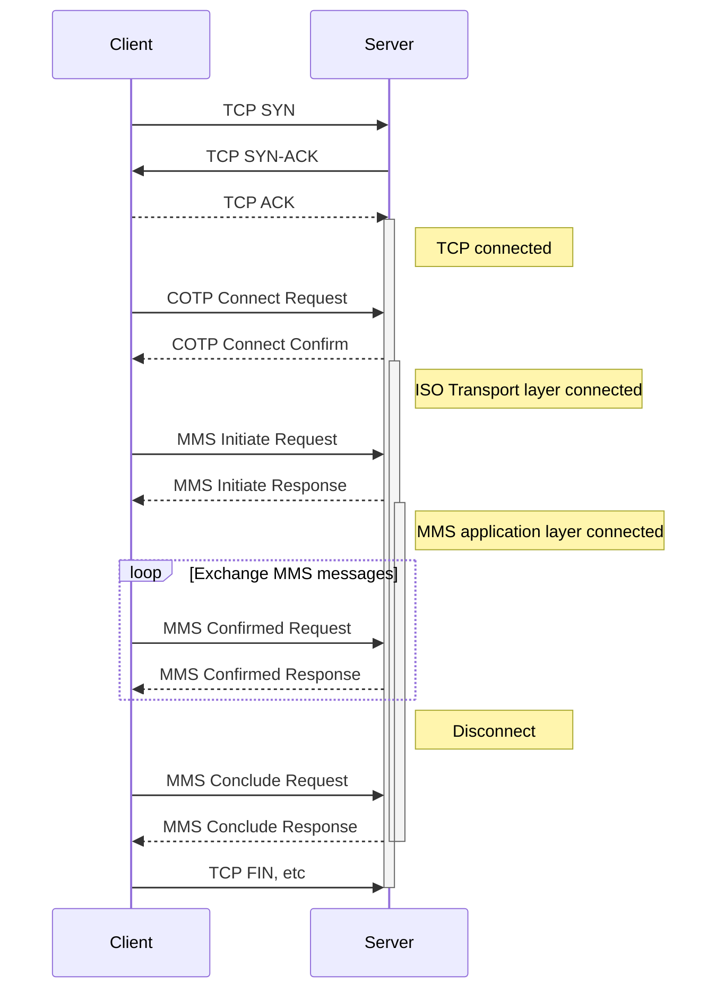
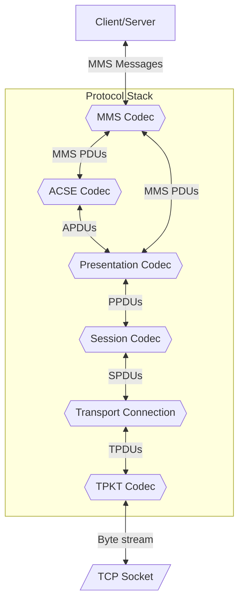
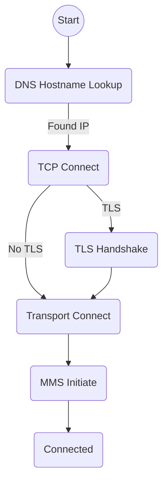
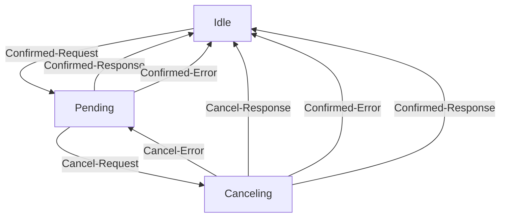

# ISO-9506 Manufacturing Message Specification (MMS) Rust Implementation

## Protocol

MMS was originally developed on top of the OSI seven layer network model, then adapted for use with TCP/IP, while retaining the original Transport, Session, Presentation, and ACSE layers. Each of these layers defines its own protocol primitives, encoding, and state machine. Because these protocol layers are no longer widely used, the MMS application layer is responsible for their implementation.

The following protocol layers are in use in common MMS implementations:

* Transport Service on top of TCP - ISO-8072, RFC-1006
* Transport Protocol - ISO-8073, RFC-905
* Session Protocol - ISO-8327, X.225
* Presentation Protocol - ISO-8823, X.226
* Association Control Service - ISO-8650, X.227
* Manufacturing Message Specification - ISO-9506

This library aims to implement a minimal subset of protocol functionality required for operation, while conforming to the requirements outlined in the specification and enforcing correct message structure.

### Connection Setup and Tear-down



### Data Flow



## Client Library

### Connection Process



### Confirmed Request State Machine



## Server Library

TODO

## Client Command Line Tool

```text
$ mms-client --help

Usage: mms-client [OPTIONS] <HOST> <COMMAND>

Commands:
  identify   Identify
  list       Get Name List
  read       Read variable(s)
  read-list  Read a variable list
  write      Write variable
  help       Print this message or the help of the given subcommand(s)

Arguments:
  <HOST>  Server hostname or IP address

Options:
      --debug                      Enable debug logging
      --tls                        Enable TLS
      --ca-cert <CA_CERT>          Set TLS CA certificate
      --client-cert <CLIENT_CERT>  Set mTLS client certificate
      --client-key <CLIENT_KEY>    Set mTLS client key
      --cert-domain <CERT_DOMAIN>  Set the FQDN of the server certificate (if different than 'host')
  -p, --port <PORT>                Server port [default: 102]
  -h, --help                       Print help
```
